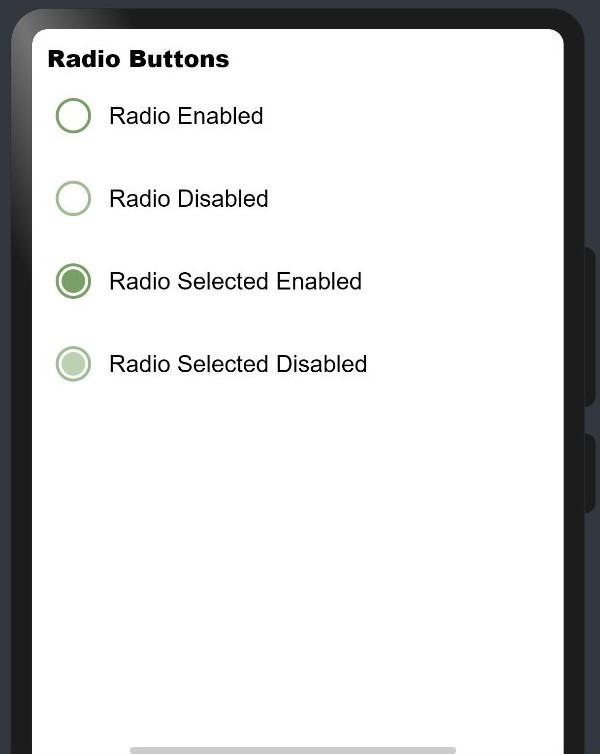
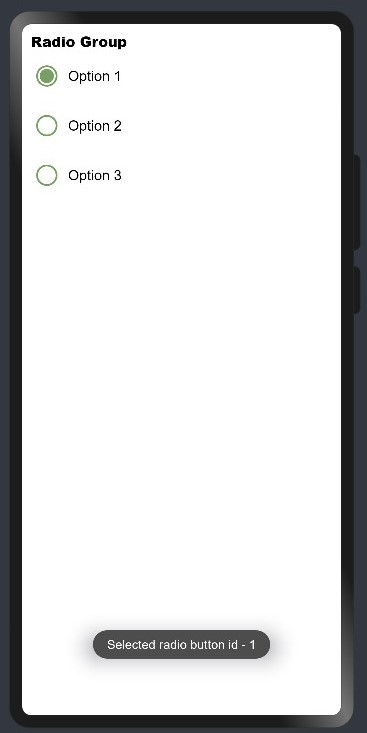

## Material Design

**Material Design** is the standard for designing and creating websites and apps. It’s been a response to old, user-unfriendly, and chaotic design styles and its aim is to bring order and unity to web design.

Material Design was inspired by the physical world. What Material Design did was move away from designing completely flat UIs to designing surfaces that were inspired by paper and ink. Think of it like this:

`When looked at head-on, a sheet of paper appears flat and two-dimensional. However, in the real world, that’s not actually how it behaves.`

Paper exists in three dimensions. Sheets of paper create shadows, seams, and folds and can be cut and resized for our needs — recreated in the digital space with Material Design. 

## Radio Button

A radio button or option button is a graphical control element that allows the user to choose only one of a predefined set of mutually exclusive options.

Radio buttons are arranged in groups of two or more and displayed on screen as a list of circular holes that can contain white space (for unselected) or a dot (for selected). The choices are mutually exclusive; when the user selects a radio button, any previously selected radio button in the same group becomes deselected.

<hr/>

**Library Name:** Material Radio Button

**Library Version:** API 8 and above

**Library Release Date:** 06/06/2022

**Library Overview (Description):** This library is developed to provide material radio button/group implemented using extended typescript.

**GitHub link:** [https://github.com/Applib-OpenHarmony/MeterialRadio](https://github.com/Applib-OpenHarmony/MeterialRadio)

<hr/>

## Download & Install:

Install using npm: 
```
npm i ohos-material-radio
```

Details about OpenHarmony NPM environment configuration, click [here](https://gitee.com/openharmony-tpc/docs/blob/master/OpenHarmony_npm_usage.md). 

<hr/>

## Usage Instructions:

1. Import files and code dependencies

```ets
import { RadioButton, RadioGroup, RadioOption, RadioModel }  from '@ohos/material-radio'
```

2. Initialize model data

```
private radioModel: RadioModel = new RadioModel(1, "Radio Label")
```

3. Code for creating radio button

```
RadioButton({
    checked: true,
    model: this.radioModel,
    onCheckChange: (selectedRadioId) => {
        console.log("Selected Radio Button Id:: " + selectedRadioId);
    }
})
```


4. Code for creating radio group

```
RadioGroup(
    {
        selectedRadioId: 1,
        options: [new RadioOption(1, "Option 1"), new RadioOption(2, "Option 2")],
        onCheckChange: (selectedRadioId) => {
            console.log("Selected Radio Button Id:: " + selectedRadioId);
        }
    }
)
```


<hr/>

## Library Features:

### Feature-1: 

***Description:*** User needs to provide radioId, radiolabel, selectedRadioId to create material radio button. Apart from those user can also send checked and disabled properties also.

***Code Snippet:***

```
RadioButton({
    radioId: 1,
    radioLabel: $r('app.string.radio_button'),
    selectedRadioId: $selectedRadioId,
    checked: true,
    disabled: false,
    onSelect: (id) => {
        console.log(“Selected id:: “ + id)
    }
}) 
```

***Screenshot:***



<br>

### Feature-2: 

***Description:*** User needs to provide radio options list to create material radio group.

***Code Snippet:***

```
RadioGroup({
    options: this.radioOptions,
    selectedRadioId: $selectedRadioId,
    onSelect: (id) => {
        console.log("Selected radio button id - " + id)
    }
}) 

```

***Screenshot:***



<hr/>

## Conclusion:
This library is useful for providing material designs effects in radio button/group components. We can also give other specification like whether radio button is checked, disabled and a callback function to listen for changes on the radio button check status.

<hr/>

## Code Contribution:
If you find any problems during usage, you can submit an [Issue](https://github.com/Applib-OpenHarmony/MeterialRadio/issues) to us. Of course, we also welcome you to send us [PR](https://github.com/Applib-OpenHarmony/MeterialRadio/pulls).

<hr/>

## Reference:

**Designed by:** Dharma Seelan
